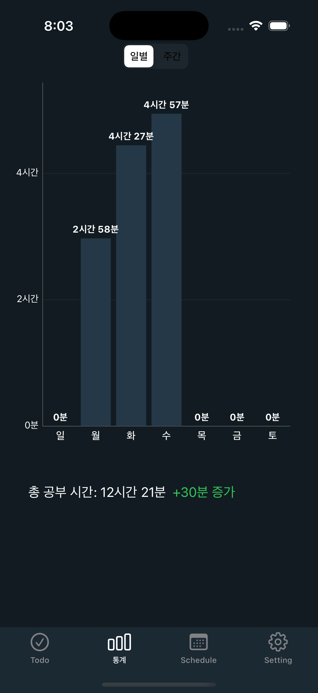

# 📸 MyStudyPlan

## 프로젝트 개요

**MyStudyPlan**은 자신의 공부량을 시간 단위로 기록하고 시각화하여 성취감을 높이고, 꾸준한 학습 습관 형성을 돕는 모바일 앱입니다.

---

## 주요 기능

| 번호 | 기능명 | 설명 |
|---|---|---|
| 1 | 할 일 목록 확인 | 오늘의 할 일 리스트 확인 |
| 2 | 할 일 추가 | 새로운 할 일 등록 |
| 3 | 일별 통계 | 하루 동안의 공부 시간 통계 시각화 |
| 4 | 월별 통계 | 한 달 동안의 공부 시간 통계 시각화 |
| 5 | 일정 확인 | 전체 스케줄 및 캘린더 확인 |
| 6 | 설정 | 알림 설정, 계정 관리 등 |

---

## 기술 스택

| 분류 | 내용 |
|---|---|
| 개발 언어 | Swift |
| 개발 도구 | Xcode |
| 백엔드 서비스 | Firebase |
| 주요 패키지 | Firebase SDK, Google Sign-In, SDWebImage 등 |

---

## 스크린샷

### Todo Screen

### Todo Add Screen

### Daily Stats Screen

### Month Stats Screen

### Schedule Screen

### Settings Screen

---

## 결과물 링크

| 항목 | 링크 |
|---|---|
| 배포 링크 | [앱 다운로드 링크](https://example.com) |
| 시연 영상 | (추후 추가) |

---
